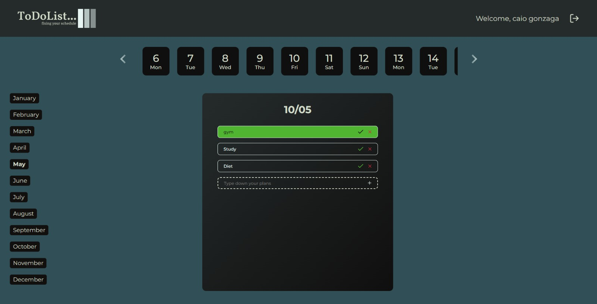

<h1 align="center">ToDoList...</h1>

<p align="center">
Welcome to ToDoList... app! <br>
</p>

## Site Link: https://foodexplorerrr.netlify.app

<p align="center">
  <a href="#-technologies">Technologies</a>&nbsp;&nbsp;&nbsp;|&nbsp;&nbsp;&nbsp;
  <a href="#-libraries">Libraries</a>&nbsp;&nbsp;&nbsp;|&nbsp;&nbsp;&nbsp;
  <a href="#-project">Project</a>&nbsp;&nbsp;&nbsp;|&nbsp;&nbsp;&nbsp;
  <a href="#memo-license">License</a>
</p>

<p align="center">
    
</p>

<br>

## 🛠️ Technologies

This project was developed with the following technologies:

- HTML and CSS
- JavaScript
- ReactJs
- SQLite
- Vite
- NodeJs
- Git and Github

## 📖 Libraries

This project was developed with the following libraries:

- styled components
- react icons
- react router dom
- react spinners
- express
- nodemon
- express-async-errors
- sqlite
- knex
- bcryptjs
- jsonwebtoken
- multer
- cors
- dotenv
- pm2

## 💻 Project

- In this application you can create tasks for your days, check and delete them, in a simply design with all the days of your year!

<br>

Clone the project

```bash
  git clone https://github.com/Caioscg/ToDoList...
```

Navigate to the project directory

```bash
  cd ToDoList
```

Install the dependencies

```bash
  npm install
```

Start the server

```bash
  npm run dev
```

<br>

## ⚙️ Back-end Repository

https://github.com/Caioscg/ToDoList...-API

## :memo: License

This project is under the MIT license.

<p align="center">
  
</p>
---

Check my others projects!👋